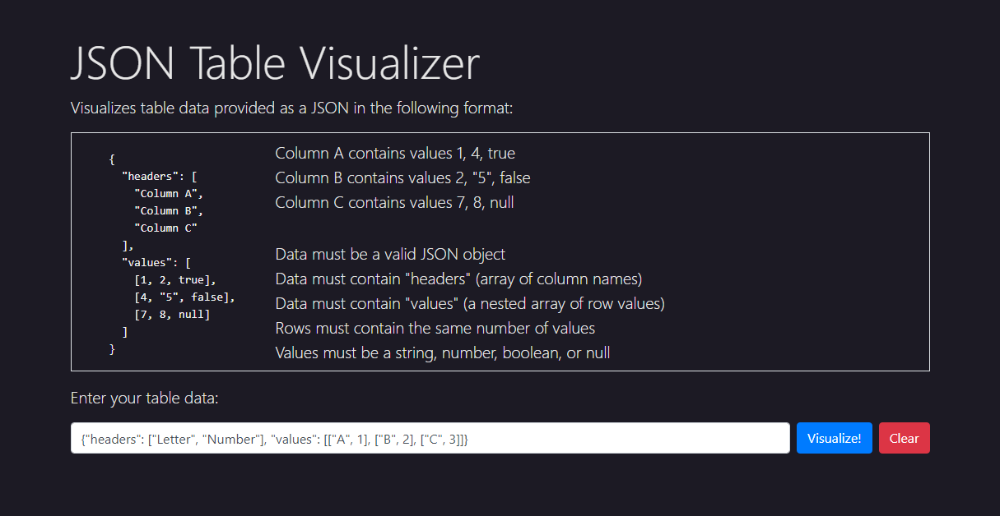
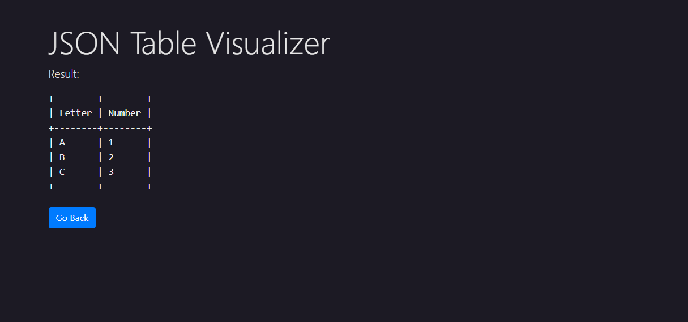

# JSON Table Visualizer

Visualizes a table given as a JSON string containing headers and row values. I built this specifically to help visualize input/output values for database problems on [Leetcode](https://leetcode.com/) (they use the specified format).

<b><a href="https://ahhreggi.github.io/json-table-visualizer/" target="_blank">
   » View Live Project «
</a></b>

Multi-table support coming soon. :)

