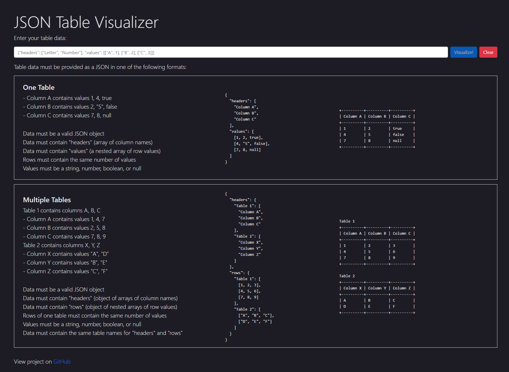

# 🔎 JSON Table Visualizer

<b>JSON Table Visualizer</b> is a responsive single-page application that converts JSON strings containing table headers and row values into plain text tables. Supports single and multi-table data and dynamically checks for input/formatting errors as you type. Built with HTML, CSS/[SASS](https://sass-lang.com/), JavaScript, and [jQuery](https://jquery.com/).

<b><a href="https://ahhreggi.github.io/json-table-visualizer/" target="_blank">
   » View Live Project «
</a></b>

This was specifically designed to help visualize input/output values for database problems on [Leetcode](https://leetcode.com/) (they use the specified format).

